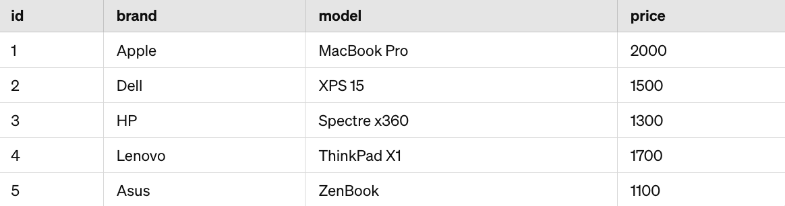

# Inventory Tracker Lab

### Learning Goals

- Practice building functions that use iteration and controlling their return
  values
- Practice manipulating objects (adding elements, removing elements, etc.)

### Key Vocab

- **Interpreter**: A program that executes other programs. JavaScript programs
require the JavaScript interpreter to be installed on your computer so that they
can be run.
- **Data Type**: A specific kind of data that determines which actions can be performed on different data items. The JavaScript interpreter uses these types to determine the behavior of variables and expressions.
- **Exception**: An error condition that can be predicted and handled without
causing a program to crash. In JavaScript, exceptions can be caught and managed using try-catch blocks.
- **Code Block**: A collection of code statements that are executed together. JavaScript uses curly braces {} to define code blocks.
- **Function**: A named block of code that performs a specific task when called. Functions are a fundamental building block of JavaScript programs.
- **Scope**: The context in which variables are accessible in a JavaScript program. Variables declared within a specific scope are only accessible within that scope.

### Introduction

Welcome to the Inventory Tracker Lab! In this lab, you'll apply your knowledge of JavaScript objects to create a complex data structure representing a fictional company's inventory. You'll then implement functions to perform intricate operations on this data.

### Instructions

To get started, run `npm install` to install the necessary dependencies. Then run `npm test` to run
your tests. Use these instructions and mocha's error messages to complete
your work in the index.js file.

1. Create an object called **`inventory`** in the top scope of your index.js file. This object should have the following keys at the top level: `computers`, and `phones`. The values for those keys should be non-empty arrays. Each element in the `computers` and `phones` arrays should be an object with the following keys: `id`, `brand`, `price`, and `model`. Use the tables below to populate the arrays with the provided data.

**Note**: The inventory object you create here is just a specific example. The functions you implement will receive similar inventory objects as arguments, but those will likely have different values. Your functions should work for any inventory object with computers and phones keys.

2. **`getTotalInventoryValue()`**: this function should take an inventory object as an argument and return a number representing the total value of all the items in the inventory. Remember that each inventory object has computers and phones keys, which are arrays of objects. Each object in the computers and phones arrays has a price key that represents the value of that item.

3. **`findCheapestItem()`**: this function should take an inventory object and a string representing a category as arguments (`computers` or `phones`). The function should return an object representing the cheapest item in the specified category. If the category is not valid, the function should return null.

4. **`findExpensiveItems()`**: this function should take the inventory object and a price threshold as parameters and return an array of items that are more expensive than the given threshold. Each item in the returned array should be an object with the following keys: `category`, `brand`, `model`, and `price`.

### Conclusion
In this lab, you created a complex Object representing inventory data for a company and implemented functions to manipulate and analyze this data. This exercise helped reinforce your understanding of JavaScript objects and their practical applications.

### Resources

- [MDN: Object.keys()][keys]
- [MDN: Object.values()][values]
- [MDN: Object.items()][entries]
- [MDN: Object.assign()][assign]
- [While Loops][iterate-with-index]

[keys]: https://developer.mozilla.org/en-US/docs/Web/JavaScript/Reference/Global_Objects/Object/keys
[values]: https://developer.mozilla.org/en-US/docs/Web/JavaScript/Reference/Global_Objects/Object/values
[entries]: https://developer.mozilla.org/en-US/docs/Web/JavaScript/Reference/Global_Objects/Object/entries
[assign]: https://developer.mozilla.org/en-US/docs/Web/JavaScript/Reference/Global_Objects/Object/assign
[iterate-with-index]: https://developer.mozilla.org/en-US/docs/Web/JavaScript/Guide/Loops_and_iteration#while_statement